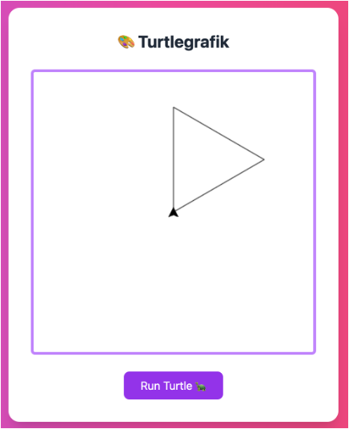
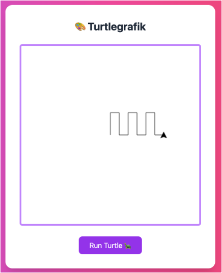
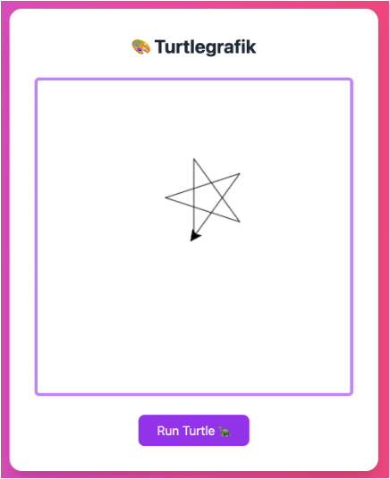
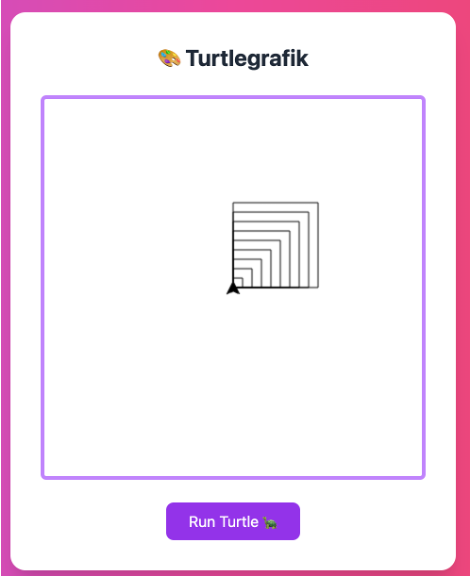
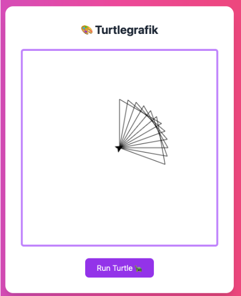
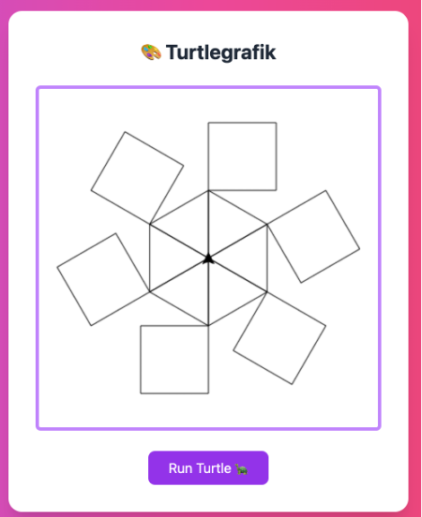
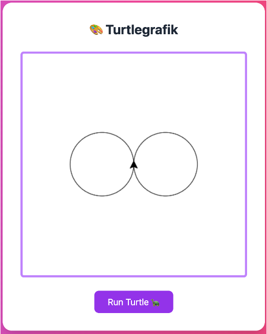
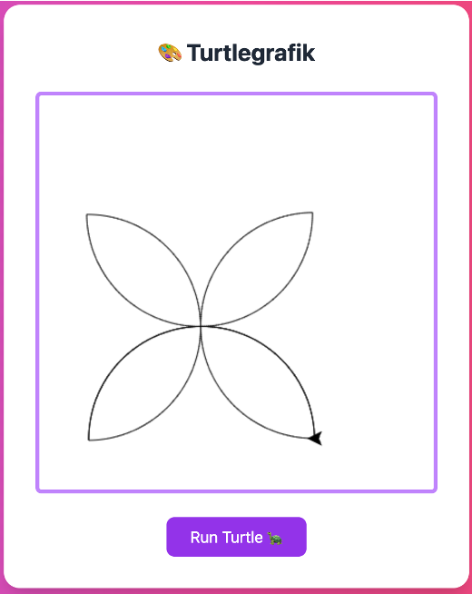
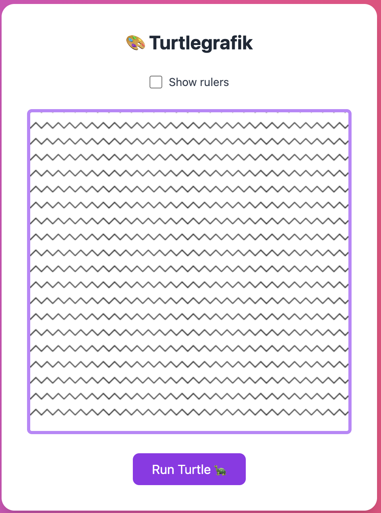
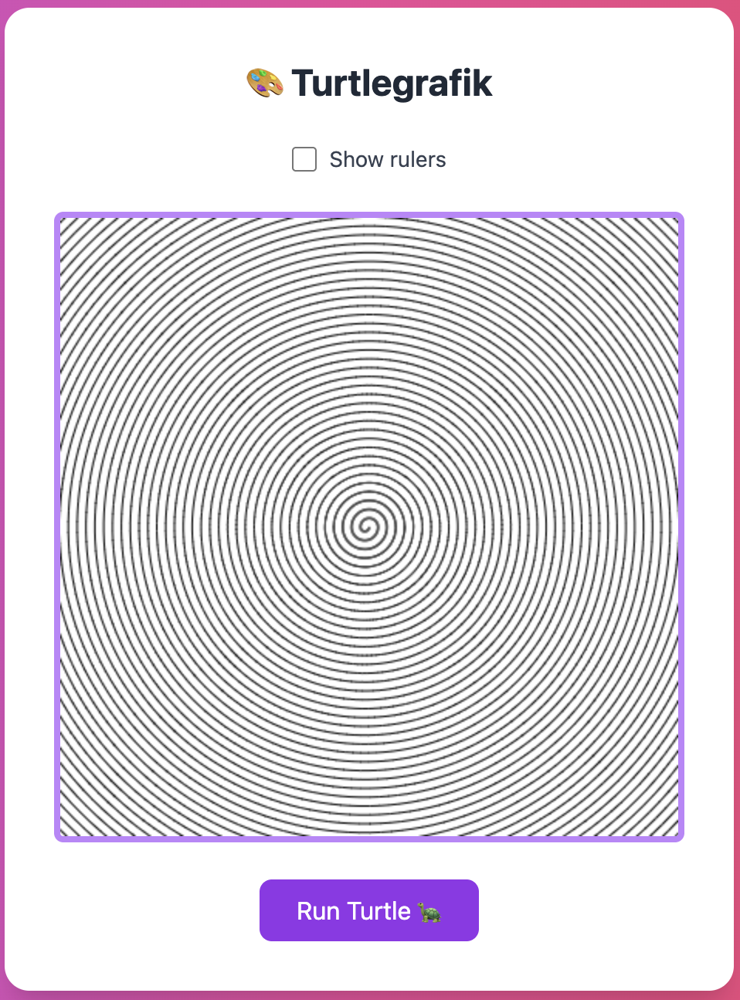

# Inhalt

1. [Setup & Start](#setup--start)
2. [Dreieck](#dreieck)
3. [Zahnrad](#zahnrad)
4. [Stern](#stern)
5. [Funktionen - Quadrate](#funktionen---quadrate)
6. [Funktionen - Triangles](#funktionen---triangles)
7. [Funktionen - Triangle + Quadrat](#funktionen---triangle--quadrat)
8. [Schleifen - Zwei Kreise](#schleifen---zwei-kreise)
9. [Schleifen - Blume](#schleifen---blume)
10. [Zickzack](#zickzack)
11. [Spirale](#spirale)
12. [Farbige Blume](#farbige-blume)
13. [Sei Kreativ!](#sei-kreativ)

---

## Setup & Start

1. Lade das zip file [js-turtle.zip](../js-turtle.zip) herunter und entpacke es.
2. Öffne den Ordner im VS Code
3. Lies dir das readme durch.
4. Löse die Aufgaben.

---

## Dreieck

**Beschreibung:** Ein gleichseitiges Dreieck.

**Screenshot:**  


---

## Zahnrad

**Screenshot:**  


---

## Stern

**Beschreibung:** Ein 5-Zack-Stern (klassischer Pentagon-Stern, Innenwinkel-Turn 144°).

**Screenshot:**  


---

## Funktionen - quadrate

**Screenshot:**  


---

## Funktionen - triangles

**Screenshot:**  


---

## Funktionen - triangle + quadrat

**Screenshot:**  


---

## Schleifen - Zwei Kreise

**Screenshot:**  


---

## Schleifen - Blume

**Screenshot:**  


---

## Zickzack

**Screenshot:**  


---

## Spirale

**Screenshot:**  


---

## Farbige Blume

**Screenshot:**  


---

## Referenz

- **Real Turtle (JS):** https://github.com/leonceaklin/real-turtle#commands
- Nützliche Befehle: `forward`, `right`, `left`, `penUp`, `penDown`, `goTo`, `setSpeed`


## Farbige Blume

**Tipp: So kannst du etwas enfärben**

```javascript
turtle.beginPath();
turtle.setFillStyle("rgba(233, 10, 10, 0.8)");
quadrat(); //  zum Beispiel
turtle.fill();
turtle.closePath();
```


## Sei Kreativ!

Denke dir selber Formen aus und lasse den Turtle zeichnen!
