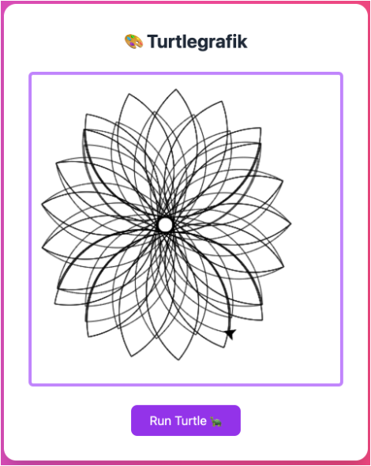

# Turtle -  Loesungen
## 🎨 Inhalt

2. [Dreieck](#dreieck)
3. [Zahnrad](#zahnrad)
4. [Stern](#stern)
5. [Funktionen - Quadrate](#funktionen---quadrate)
6. [Funktionen - Triangles](#funktionen---triangles)
7. [Funktionen - Triangle + Quadrat](#funktionen---triangle--quadrat)
8. [Schleifen - Kreis](#schleifen---kreis)
9. [Schleifen - Blume](#schleifen---blume)
10. [Schleifen - Mandala](#schleifen---mandala)
11. [Zickzack](#zickzack)
12. [Spirale](#spirale)
13. [Farbige Blume](#farbige-blume)
14. [Circle of circles](#circle-of-circles)
15. [Referenz](#referenz)rafik — Lösungen & Screenshots

---

## Dreieck

**Beschreibung:** Ein gleichseitiges Dreieck.

**Turtle-Code:**

```javascript
turtle.forward(100);
turtle.right(120);
turtle.forward(100);
turtle.right(120);
turtle.forward(100);
turtle.right(120);
```

**Screenshot:**  


---

## Zahnrad

**Turtle-Code:**

```javascript
// Erste Zacke
turtle.forward(50);
turtle.right(90);
turtle.forward(20);
turtle.right(90);
turtle.forward(50);
turtle.left(90);
turtle.forward(20);
turtle.left(90);

// Zweite Zacke
turtle.forward(50);
turtle.right(90);
turtle.forward(20);
turtle.right(90);
turtle.forward(50);
turtle.left(90);
turtle.forward(20);
turtle.left(90);

// Dritte Zacke
turtle.forward(50);
turtle.right(90);
turtle.forward(20);
turtle.right(90);
turtle.forward(50);
turtle.left(90);
turtle.forward(20);
turtle.left(90);
```

**Screenshot:**  


---

## Stern

**Beschreibung:** Ein 5-Zack-Stern (klassischer Pentagon-Stern, Innenwinkel-Turn 144°).

**Turtle-Code:**

```javascript
turtle.forward(100);
turtle.right(144);
turtle.forward(100);
turtle.right(144);
turtle.forward(100);
turtle.right(144);
turtle.forward(100);
turtle.right(144);
turtle.forward(100);
```

**Screenshot:**  


---

## Funktionen - quadrate

**Screenshot:**  


**Turtle-Code:**

```javascript
function quadrat(size) {
  turtle.forward(size);
  turtle.right(90);
  turtle.forward(size);
  turtle.right(90);
  turtle.forward(size);
  turtle.right(90);
  turtle.forward(size);
  turtle.right(90);
}

quadrat(60);
quadrat(70);
quadrat(80);
quadrat(90);
```

---

## Funktionen - triangles

**Screenshot:**  


**Turtle-Code (Platzhalter):**

```javascript
function triangle(size, endRotation) {
  turtle.forward(size);
  turtle.right(120);
  turtle.forward(size);
  turtle.right(120);
  turtle.forward(size);
  turtle.right(120 + endRotation);
}

turtle.setSpeed(100);

triangle(100, 10);
triangle(100, 10);
triangle(100, 10);
triangle(100, 10);
triangle(100, 10);
triangle(100, 10);
```

---

## Funktionen - triangle + quadrat

**Screenshot:**  


**Turtle-Code (Platzhalter):**

```javascript
function quadrat(size) {
  turtle.forward(size);
  turtle.right(90);
  turtle.forward(size);
  turtle.right(90);
  turtle.forward(size);
  turtle.right(90);
  turtle.forward(size);
  turtle.right(90);
}

function triangleAndQuadrat(size, endRotation) {
  turtle.forward(size);
  quadrat(size);
  turtle.right(120);
  turtle.forward(size);
  turtle.right(120);
  turtle.forward(size);
  turtle.right(120 + endRotation);
}

turtle.setSpeed(100);

triangleAndQuadrat(80, 60);
triangleAndQuadrat(80, 60);
triangleAndQuadrat(80, 60);
triangleAndQuadrat(80, 60);
triangleAndQuadrat(80, 60);
triangleAndQuadrat(80, 60);
```

---

## Schleifen - Kreis

**Screenshot:**  


**Turtle-Code (Platzhalter):**

```javascript
turtle.setSpeed(1);

for (let i = 0; i < 360; i++) {
  turtle.forward(1);
  turtle.right(1);
}
```

---

## Schleifen - Blume

**Screenshot:**  


**Turtle-Code (Platzhalter):**

```javascript
turtle.setSpeed(1); // set speed
turtle.setPosition(50, 350); // set position

/**
 * Zeichnen eines Bogens
 */
function bow() {
  for (let i = 0; i < 180; i++) {
    turtle.forward(2);
    turtle.right(1);
  }
}

for (let i = 0; i <= 4; i++) {
  bow();
  turtle.right(90);
}
```

---

## Schleifen - Mandala

**Screenshot:**  


**Turtle-Code:**

```javascript
turtle.setSpeed(1); // set speed
turtle.setPosition(70, 320); // set position

/**
 * Zeichnen eines Bogens
 */
function bow() {
  for (let i = 0; i < 180; i++) {
    turtle.forward(2);
    turtle.right(1);
  }
}

function flower() {
  for (let i = 0; i < 6; i++) {
    bow();
    turtle.right(90);
  }
}

for (let i = 0; i <= 10; i++) {
  flower();
  turtle.right(10);
}
```

---

## Zickzack

**Screenshot:**  


**Turtle-Code (Platzhalter):**

```javascript
turtle.setSpeed(1);

function drawZickZack() {
  for (let i = 0; i < 30; i++) {
    turtle.forward(10);
    turtle.right(90);
    turtle.forward(10);
    turtle.left(90);
  }
}

turtle.right(45); // Das brauchen wir, da der Turtle zu Beginn nach Oben schaut.

for (let i = 0; i < 20; i++) {
  turtle.setPosition(0, i * 20);
  drawZickZack();
}
```

---

## Spirale

**Screenshot:**  


**Turtle-Code (Platzhalter):**

```javascript
// Spiral starting from canvas center (400x400 -> center at 200,200)
turtle.setSpeed(1);

function bow(size) {
  for (let i = 0; i < 90; i++) {
    turtle.forward(size);
    turtle.right(2);
  }
}

for (let i = 0; i < 100; i = i + 0.1) {
  bow(i);
}
```

---

## Farbige Blume

**Screenshot:**  


**Turtle-Code (Platzhalter):**

```javascript
turtle.setSpeed(1); // set speed
turtle.setPosition(70, 320); // set position

turtle.setSpeed(1); // set speed
turtle.setPosition(70, 320); // set position

/**
 * Zeichnen eines Bogens
 */
function bow() {
  for (let i = 0; i < 180; i++) {
    turtle.forward(2);
    turtle.right(1);
  }
}

function flower() {
  for (let i = 0; i < 6; i++) {
    bow();
    turtle.right(90);
  }
}

for (let i = 0; i <= 10; i++) {
  turtle.beginPath();
  turtle.setFillStyle(
    "rgba(" + (255 - i * 20) + ", " + i * 25 + ", " + (100 + i * 15) + ", 0.8)"
  );
  flower(i * 10);
  turtle.fill();
  turtle.closePath();
  turtle.right(10);
}
```

---

## Circle of circles

**Screenshot:**  


```javascript
turtle.setSpeed(10); // Set the speed of the turtle
  function circle(size) {
    for (let i = 0; i < 360; i++) {
      turtle.forward(size);
      turtle.right(1);
    }
  }

  for (let i = 0; i < 36; i++) {
    circle(1);
    turtle.forward(3);
    turtle.left(10);
  }
```
## Referenz

- **Real Turtle (JS):** https://github.com/leonceaklin/real-turtle#commands
- Nützliche Befehle: `forward`, `right`, `left`, `penUp`, `penDown`, `goTo`, `setSpeed`
