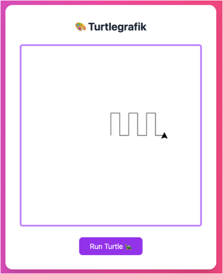

# 🎨 Turtlegrafik — Lösungen & Screenshots

---

## Inhalt

1. [Setup & Start](#setup--start)
2. [Beispiel 1: Dreieck](#beispiel-1-dreieck)
3. [Beispiel 2: Zahnrad-Zackenkante](#beispiel-2-zahnrad-zackenkante)
4. [Beispiel 3: Stern](#beispiel-3-stern)
5. [Beispiel 4: Funktionen – viele Quadrate](#beispiel-4-funktionen--viele-quadrate)
6. [Beispiel 5: Linien (Platzhalter)](#beispiel-5-linien-platzhalter)
7. [Referenz](#referenz)

---

## Setup & Start

In deinem HTML wird die Zeichnung in der `start()`-Funktion erzeugt.  
Die folgenden Codeblöcke enthalten **nur den Turtle-Teil** – du kannst sie direkt in den Bereich

```js
// --> Start of Turtle Code <--
/* ...hier einfügen... */
// --> End of Turtle Code <--
```

einfügen.

---

## Beispiel 1: Dreieck

**Beschreibung:** Ein gleichseitiges Dreieck.

**Turtle-Code:**

```javascript
turtle.forward(100);
turtle.right(120);
turtle.forward(100);
turtle.right(120);
turtle.forward(100);
turtle.right(120);
```

**Screenshot:**  


---

## Beispiel 2: Zahnrad-Zackenkante

**Beschreibung:** Eine wiederholte **hoch → rechts → runter → rechts**-Zacke, die wie eine Zahnradkante aussieht.  
_(Dein Original hat drei Zacken; unten ist exakt dieselbe Sequenz.)_

**Turtle-Code:**

```javascript
// Erste Zacke
turtle.forward(50);
turtle.right(90);
turtle.forward(20);
turtle.right(90);
turtle.forward(50);
turtle.left(90);
turtle.forward(20);
turtle.left(90);

// Zweite Zacke
turtle.forward(50);
turtle.right(90);
turtle.forward(20);
turtle.right(90);
turtle.forward(50);
turtle.left(90);
turtle.forward(20);
turtle.left(90);

// Dritte Zacke
turtle.forward(50);
turtle.right(90);
turtle.forward(20);
turtle.right(90);
turtle.forward(50);
turtle.left(90);
turtle.forward(20);
turtle.left(90);
```

**Screenshot:**  


> Hinweis: In deinem HTML wurde zwischen den Beispielen `context.clearRect(...)` genutzt.  
> Für einzelne Screenshots kannst du die **Canvas** vor jedem Beispiel leeren.

---

## Beispiel 3: Stern

**Beschreibung:** Ein 5-Zack-Stern (klassischer Pentagon-Stern, Innenwinkel-Turn 144°).

**Turtle-Code:**

```javascript
turtle.forward(100);
turtle.right(144);
turtle.forward(100);
turtle.right(144);
turtle.forward(100);
turtle.right(144);
turtle.forward(100);
turtle.right(144);
turtle.forward(100);
```

**Screenshot:**  


---

## Funktionen - quadrate

**Screenshot:**  


**Turtle-Code:**

```javascript
function quadrat(size) {
  turtle.forward(size);
  turtle.right(90);
  turtle.forward(size);
  turtle.right(90);
  turtle.forward(size);
  turtle.right(90);
  turtle.forward(size);
  turtle.right(90);
}

quadrat(60);
quadrat(70);
quadrat(80);
quadrat(90);
```

---

## Funktionen - triangles

**Screenshot:**  


**Turtle-Code (Platzhalter):**

```javascript
function triangle(size, endRotation) {
  turtle.forward(size);
  turtle.right(120);
  turtle.forward(size);
  turtle.right(120);
  turtle.forward(size);
  turtle.right(120 + endRotation);
}

turtle.setSpeed(100);

triangle(100, 10);
triangle(100, 10);
triangle(100, 10);
triangle(100, 10);
triangle(100, 10);
triangle(100, 10);
```

---

## Funktionen - triangle + quadrat

**Screenshot:**  


**Turtle-Code (Platzhalter):**

```javascript
function quadrat(size) {
  turtle.forward(size);
  turtle.right(90);
  turtle.forward(size);
  turtle.right(90);
  turtle.forward(size);
  turtle.right(90);
  turtle.forward(size);
  turtle.right(90);
}

function triangleAndQuadrat(size, endRotation) {
  turtle.forward(size);
  quadrat(size);
  turtle.right(120);
  turtle.forward(size);
  turtle.right(120);
  turtle.forward(size);
  turtle.right(120 + endRotation);
}

turtle.setSpeed(100);

triangleAndQuadrat(80, 60);
triangleAndQuadrat(80, 60);
triangleAndQuadrat(80, 60);
triangleAndQuadrat(80, 60);
triangleAndQuadrat(80, 60);
triangleAndQuadrat(80, 60);
```

---

## Schleifen - Zwei Kreise

**Screenshot:**  


**Turtle-Code (Platzhalter):**

```javascript
turtle.setSpeed(1);

for (let i = 0; i < 360; i++) {
  turtle.forward(1);
  turtle.right(1);
}

for (let i = 0; i < 360; i++) {
  turtle.forward(1);
  turtle.left(1);
}
```

---

## Schleifen - Blume

**Screenshot:**  


**Turtle-Code (Platzhalter):**

```javascript
turtle.setSpeed(1); // set speed
turtle.setPosition(50, 350); // set position

/**
 * Zeichnen eines Bogens
 */
function bow() {
  for (let i = 0; i < 180; i++) {
    turtle.forward(2);
    turtle.right(1);
  }
}

for (let i = 0; i <= 4; i++) {
  bow();
  turtle.right(90);
}
```

---

## Schleifen - Blume

**Screenshot:**  


**Turtle-Code (Platzhalter):**

```javascript
turtle.setSpeed(1); // set speed
turtle.setPosition(70, 320); // set position

/**
 * Zeichnen eines Bogens
 */
function bow() {
  for (let i = 0; i < 180; i++) {
    turtle.forward(2);
    turtle.right(1);
  }
}

function flower() {
  for (let i = 0; i < 6; i++) {
    bow();
    turtle.right(90);
  }
}

for (let i = 0; i <= 10; i++) {
  flower();
  turtle.right(10);
}
```

---
## Farbige Blume

**Screenshot:**  


**Turtle-Code (Platzhalter):**

```javascript
turtle.setSpeed(1); // set speed
turtle.setPosition(70, 320); // set position

        turtle.setSpeed(1); // set speed
        turtle.setPosition(70, 320); // set position

        /**
         * Zeichnen eines Bogens
         */
        function bow() {
          for (let i = 0; i < 180; i++) {
            turtle.forward(2);
            turtle.right(1);
          }
        }

        function flower() {
          for (let i = 0; i < 6; i++) {
            bow();
            turtle.right(90);
          }
        }

        for (let i = 0; i <= 10; i++) {
          turtle.beginPath();
          turtle.setFillStyle(
            "rgba(" +
              (255 - i * 20) +
              ", " +
              i * 25 +
              ", " +
              (100 + i * 15) +
              ", 0.8)"
          );
          flower(i * 10);
          turtle.fill();
          turtle.closePath();
          turtle.right(10);
        }
```

---

# Zusatzaufgaben - Lösungen

## Farbige Blume


## Referenz

- **Real Turtle (JS):** https://github.com/leonceaklin/real-turtle#commands
- Nützliche Befehle: `forward`, `right`, `left`, `penUp`, `penDown`, `goTo`, `setSpeed`
