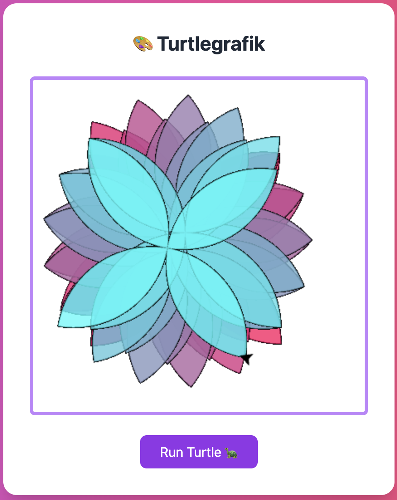

# Turtle Zusatzaufgaben

## Farbige Blume

**Tipp: So kannst du etwas enfärben**

```javascript
turtle.beginPath();
turtle.setFillStyle("rgba(233, 10, 10, 0.8)");
quadrat(); //  zum Beispiel
turtle.fill();
turtle.closePath();
```


