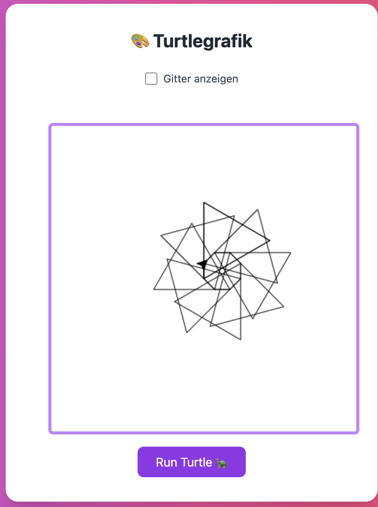

# Übungsaufgaben

## 1 Turtle code
Schreibe den Turtle code zu dieser Figur.<br>

```
Tipp:
8x {
  Dreieck
  vorwärts 20
  rechts 45
}
```


**Screenshot:**  


## 2 Funktionen
Schreiben Sie eine Funktion, welche ein Quadrat zeichnet. Nennen Sie die Funktion "square" und nehmen Sie einen Parameter "size" entgegen. Rufen Sie die Funktion dann mit einem beliebigen Wert auf.

## 3 Funktionen
Was macht die folgende Funktion, und was bewirken die Parameter?
```javascript
function myFunction(param) {
    for(let i = 0; i < 180; i++) {
        turtle.forward(param);
        turtle.right(1);
    }
}
```

## 4 If / Else
Schreiben Sie ein Javascript programm, welches nach dem Alter fragt und entsprechend den Preis für das Kinoticket ausgibt. Folgende Berechnung:<br><br>
**Unter 12 Jährig:** 10 Franken<br>
**Ab 12 Jahren bis und mit 15 Jahren:** 12 Franken
**Ab 16 Jahren:** 15 Franken<br>

Ergänzen Sie den untenstehenden Code. Geben Sie den Frankenbetrag mit der Logfunktion `console.log("XX Franken")` an.

```javascript
const age = getInput();

// Hier weiterfahren
```

## 5 if / else
Wie oft wird die folgende Schleife ausgeführt?
```javascript
for(let i = 0; i < 7; i++) {
    console.log(i);
}
```

## 6 if / else
Ein Passwort soll mindestens 12 Zeichen haben. Wenn nicht, soll eine Errormeldung erscheinen. Schreiben Sie den Code mit den nachfolgenden Hilfestellungen.

```javascript
const myString = "Hello, World";
// die .length Funktion gibt die Länge des Strings an.
const length = myString.length; // 12

// die alert() Funktion gibt eine Warnung aus.
alert("Hello, world!");
```

## 7 DOM Manipulation
Gegeben ist die folgende HTML Struktur. Schreiben Sie Javascript Code, welcher beim Klick auf das Element mit der ID "bild" das Element löscht.

```html
<html>
    <body>
        
        <div class="caption">
            some caption
        </div>
    </body>
</html>
```

## 8 DOM Manipulation
Gegeben ist die folgende HTML Struktur. Schreiben Sie Javascript Code, welcher das Element mit der Klasse "ocean" auswählt und den Hintergrund blau macht.
```html
<html>
    <body>
        <div class="ocean" width="300px" height="300px"></div>
    </body>
</html>
```

## 8 DOM Manipulation
Gegeben ist die folgende HTML Struktur. Schreiben Sie Javascript Code, welcher beim Klick auf die Taste "t" das Element mit der ID "enemy" löscht.
```html
<html>
    <body>
        <div id="enemy"></div>
    </body>
</html>
```

## 9 Variablen
Nennen Sie drei verschiedene Datentypen, die eine Variable haben kann.

## 10 Variablen
Was ist der Unterschied zwischen den folgenden 2 Variablen?
```javascript
const variable1 = 12;
let variable2 = 12;
```

## 11 Variablen
Was gibt die Konsole bei folgendem Code aus?
```javascript
let x = 7;
x = x * 2;
x = x + 10;
console.log(x);
```

## 12 Variablen
Was gibt die Konsole bei folgendem Code aus?
```javascript
let x = 20;
let y = 10;
x = x / 2;
x = x + y;
console.log(x);
```